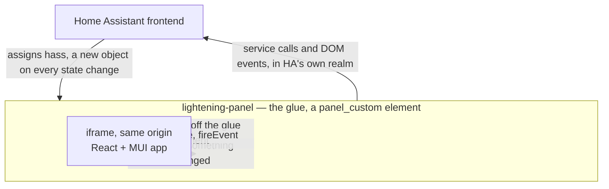

# Lightening

A Home Assistant panel for viewing and controlling entities from an SVG floor
plan. Installed as a custom integration via HACS; adds a "Lightening" item to
the HA sidebar.

> Design rationale, rejected alternatives and hard-won Home Assistant gotchas
> live in [docs/implementation.md](docs/implementation.md). Read that before
> changing anything structural.

## Architecture

A normal HA custom integration whose panel hosts a React app in an iframe:



The iframe is for isolation only — React and MUI get their own runtime, away
from HA's frontend. It's always same-origin with HA, so the app reads `hass`
straight off the glue element and holds no connection, token or state of its
own. Since HA replaces `hass` rather than mutating it, the glue rings a
payload-free doorbell and the app re-reads; nothing is serialised across the
boundary.

Going the other way, service calls pass straight through `hass`, and anything HA
exposes only as a DOM event goes through the glue's `fireEvent`.

**Config** — everything persisted apart from the SVG is one JSON document. The
backend stores it verbatim without inspecting it, so schema changes need no
integration release. Writes are guarded by a revision counter and pushed to
every open client over HA's event bus.

## Layout

| Path | What it is |
|---|---|
| `custom_components/lightening/` | The HA integration (Python) |
| `custom_components/lightening/frontend/lightening-panel.js` | Panel glue: creates the iframe, rings the doorbell |
| `custom_components/lightening/frontend/app/` | Built React app. Gitignored — CI builds it into each release tag |
| `custom_components/lightening/uploads/` | Uploaded floor plans. Gitignored; survives HACS updates |
| `custom_components/lightening/store.py` | `ConfigStore` and `FloorplanStore` |
| `frontend/` | React app source (Vite + TypeScript + MUI) |
| `frontend/src/hooks/useHass.ts` | The only place that touches the panel element |
| `frontend/src/hooks/useConfig.ts` | Config schema, migrations, revisions, push |

## Development

```bash
cd frontend
npm install
echo 'HA_TARGET=http://my-ha-host:8123' > .env.local   # once
npm run dev
```

Then open **`http://localhost:5173/lightening?dev=/lightening-app/`**. That's a
new origin, so HA asks you to log in once.

The dev server serves the app under `/lightening-app/` with HMR and proxies
everything else to `HA_TARGET`, so the app and HA share one origin exactly as in
production — there is no separate dev code path. It also serves the glue from
the working copy, making glue edits a page refresh rather than a release.

`HA_TARGET` may also come from the environment; it defaults to
`http://homeassistant.local:8123`.

`npm run build` writes into `custom_components/lightening/frontend/app/`, which
is what a release ships.

### In a container

`bin/claude` drops you into a firewalled dev container with Claude Code, Node
and the toolchain, holding no host credentials and unable to reach your LAN or
host machine. Work and commits happen in there; `bin/push` publishes from the
host. See [dev/claude/README.md](dev/claude/README.md).

## Releases

Every push to `master` triggers CI, which stamps the version into
`manifest.json`, builds the frontend, and commits the result to a **tag only** —
never back to `master`. So master carries no build artifacts or version bumps,
and you never have to pull before pushing.

Install and update through HACS as a custom repository.

## Known gaps

- **Uploaded SVGs are not sanitised.** The floor plan is inlined into the panel
  DOM (unavoidable if entities are to be bound to individual SVG nodes), so an
  SVG containing `<script>` would execute in HA's origin. Uploads are
  admin-only, which is containment rather than a fix.
- Binding entities to SVG elements is not implemented yet — uploading and
  displaying a floor plan is as far as it goes.
